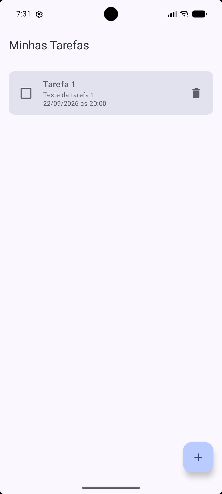
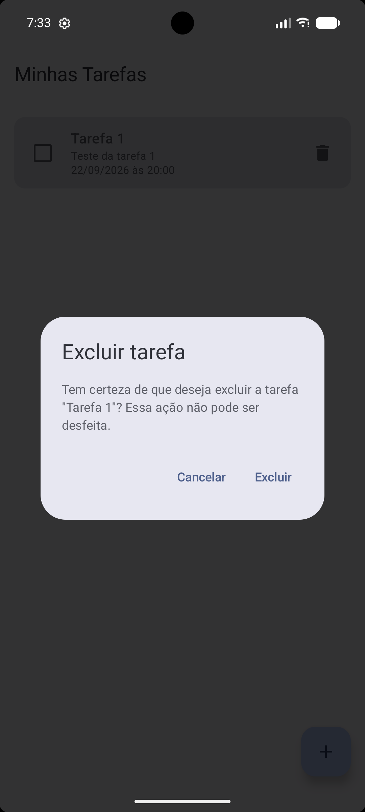
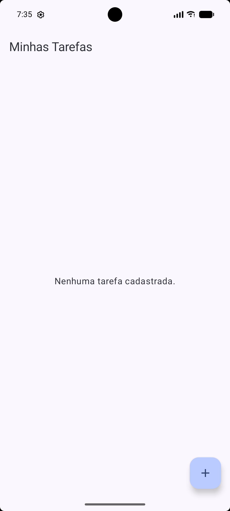

# Evidências — Fluxo de Confirmação de Exclusão

Este documento reúne as evidências do fluxo de exclusão segura de tarefas, implementado com
`AlertDialog` (Jetpack Compose Material 3) na tela `ListaTarefasScreen`.

## 1. Lista antes da exclusão

Tela inicial exibindo a tarefa que será excluída, ainda presente na lista.

## 2. Diálogo aberto com a tarefa selecionada

Ao tocar no ícone de lixeira, o `AlertDialog` é exibido sobre a própria tela da lista,
informando claramente qual tarefa (pelo título) será excluída.

## 3. Resultado ao cancelar

Ao tocar em **Cancelar**, o diálogo é fechado e a tarefa permanece na lista, sem nenhuma alteração.

## 4. Nova abertura do diálogo

O ícone de lixeira é tocado novamente na mesma tarefa, reabrindo o diálogo de confirmação.

## 5. Resultado após confirmar a exclusão

Ao tocar em **Excluir**, o diálogo é fechado e a tarefa é removida definitivamente da lista —
apenas a tarefa selecionada é excluída, as demais permanecem intactas.

